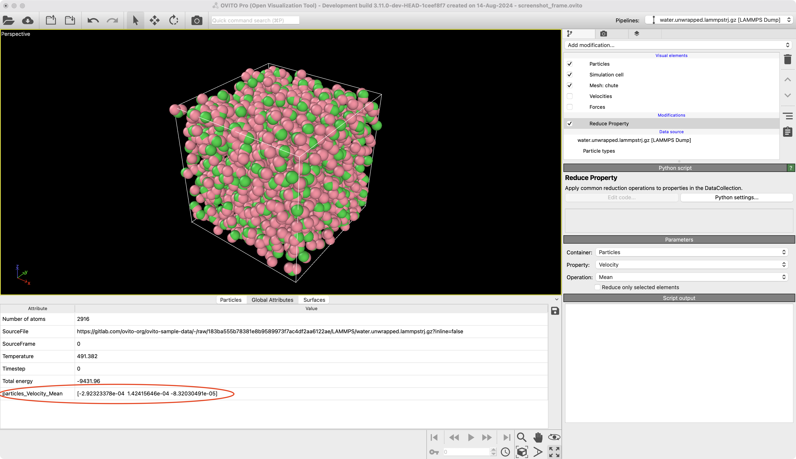

# Reduce Property
Apply common reduction operations to properties in the DataCollection

## Description
Apply one of the following reduction operations to a selected property. If the property as multiple components, e.g. position, the reduction operation is applied for each component.

Operations:

    - Mean
    - Median
    - Standard Deviation
    - Variance
    - Minimum
    - Maximum
    - Sum
    - Non-zero

## Parameters 
- `input_container` : `ovito.data.DataObject.Ref` / "Container": [Container](https://www.ovito.org/manual/python/modules/ovito_data.html#ovito.data.PropertyContainer) from which a property is selcted.
- `input_property`: `str` / "Property": [Property](https://www.ovito.org/manual/python/modules/ovito_data.html#ovito.data.Property) to which the reduction operation will be applied.
- `operation` : `str` / "Operation": Reduction operation to apply to the selected property.
- `only_selected` : `bool` / "Reduce only selected elements": Apply reduction operation only to selected entries in the property array. Requires the "Selection" property to be present in the container.

The output is stored in a [global attribute](https://www.ovito.org/manual/python/introduction/data_model.html#global-attributes) under the `<container>_<property>_<operation>` key.

## Example


```python
# Reduce Property:
pipeline.modifiers.append(
    ReduceProperty(
        input_container=DataObject.Ref(Particles, "particles"),
        input_property="Velocity",
    )
)
```

## Installation
- OVITO Pro [integrated Python interpreter](https://docs.ovito.org/python/introduction/installation.html#ovito-pro-integrated-interpreter):
  ```
  ovitos -m pip install --user git+https://github.com/ovito-org/ReduceProperty
  ``` 
  The `--user` option is recommended and [installs the package in the user's site directory](https://pip.pypa.io/en/stable/user_guide/#user-installs).

- Other Python interpreters or Conda environments:
  ```
  pip install git+https://github.com/ovito-org/ReduceProperty
  ```

## Technical information / dependencies
- Tested on OVITO version 3.11.0

## Contact
- Daniel Utt (utt@ovito.org)